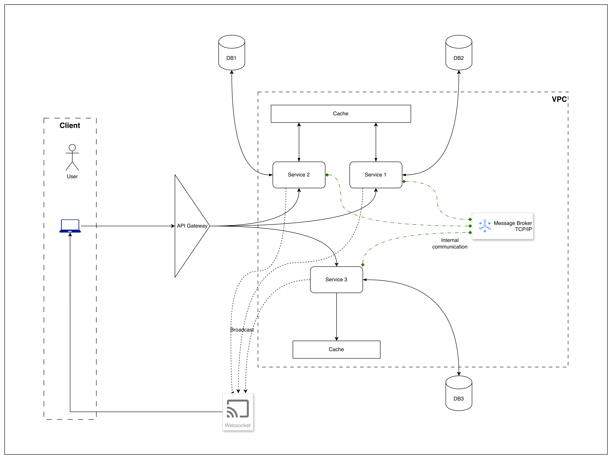
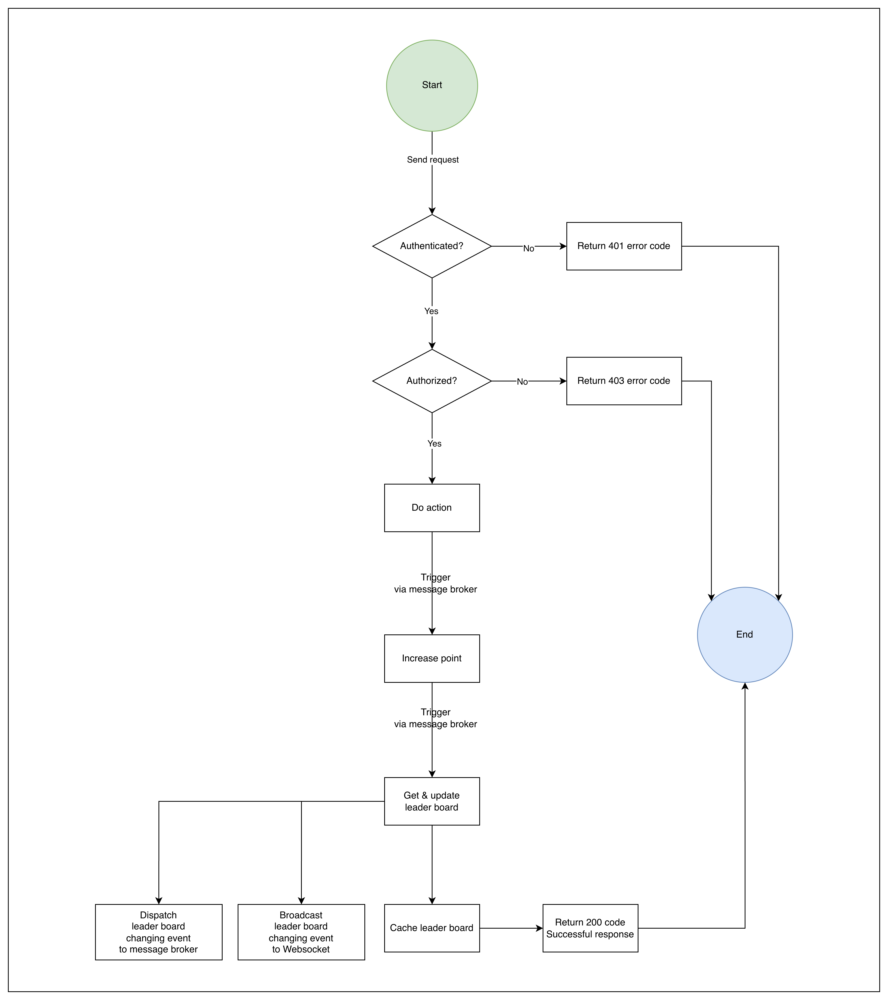

# Architecture

## Requirement
### Task
Write the specification for a software module on the API service (backend application server).

1. Create a documentation for this module on a `README.md` file.
2. Create a diagram to illustrate the flow of execution.
3. Add additional comments for improvement you may have in the documentation.
4. Your specification will be given to a backend engineering team to implement.

### Software Requirements

1. We have a website with a score board, which shows the top 10 user’s scores.
2. We want live update of the score board.
3. User can do an action (which we do not need to care what the action is), completing this action will increase the user’s score.
4. Upon completion the action will dispatch an API call to the application server to update the score.
5. We want to prevent malicious users from increasing scores without authorization.

## Solution

### General Architecture
The system will be designed using a client-server architecture with the following components:
1. Client Side (Frontend):
   - A web application that displays the score board and allows users to perform actions.
   - Uses WebSockets for real-time updates of the score board.
2. Server Side (Backend):
   - An API server that handles score updates and serves the score board data.
   - Uses RESTful API endpoints for score updates.
   - Implements authentication and authorization mechanisms to prevent unauthorized score updates.
   - This is a microservice that can be scaled independently.
   - The system is designed to handle high traffic and provide low latency responses.
   - The system will utilize caching mechanisms to improve performance.
   - The system will also include logging and monitoring for better observability.
   - Services will communicate over TCP/IP protocols.
   - Services dispatch events using a message broker for better scalability. This project will use Redis Pub/Sub for event dispatching.
3. Database:
   - Databases are independent from the services, following the Database per Service pattern.
   - The database will be designed to handle high concurrency and ensure data integrity.
4. General Architecture Diagram:

   Below is a high-level diagram illustrating the architecture of the system:

   

### Flow of Execution for Score Update

In this section, we assume that the score system was already implemented, and we are focusing on the flow of execution when a user completes an action that increases their score.

#### Diagram



#### Steps
1. User performs an action on the client side.
2. The client sends an authenticated API request to the server to update the user's score.
3. The server verifies the authentication token to ensure the request is authorized.
4. If authorized, the server updates the user's score in the database.
5. The server will publish an event to a message broker (Redis Pub/Sub) indicating that the score has been updated.
6. A score update service subscribes to the message broker and listens for score update events.
7. Upon receiving a score update event, the score update service retrieves the latest top 10 scores from the database and stores them in a cache (e.g., Redis) for quick access.
8. The score update service then broadcasts the updated score board to all connected clients via WebSockets.
9. Clients receive the updated score board and refresh the display in real-time.

#### Impacted Components
1. **Client Side**:
   - Web application to display the score board and handle user actions.
   - WebSocket client to receive real-time updates.
2. **Server Side**:
   - API server to handle score update requests and authentication.
   - Score update service to manage score updates and broadcasting.
3. **Database**:
   - User scores database to store and retrieve user scores.
4. **Message Broker**:
   - Redis Pub/Sub for event dispatching and communication between services.

### Database Schema changes
Assume that we are using a relational database (e.g., PostgreSQL) to store user scores. For the no-SQL, we can update the fields accordingly.

```sql
users (
  ...
  total_score BIGINT DEFAULT 0,
  last_score_update TIMESTAMP,
);

score_history (
  id UUID PRIMARY KEY,
  user_id UUID REFERENCES users(id),
  action_id VARCHAR(100) UNIQUE NOT NULL COMMENT 'Unique identifier for the completed action',
  score_increment INTEGER NOT NULL,
  timestamp TIMESTAMP DEFAULT NOW(),
  client_ip INET
);

CREATE INDEX idx_users_score ON users(total_score DESC);
CREATE INDEX idx_score_history_user ON score_history(user_id, timestamp);
CREATE INDEX idx_score_history_action ON score_history(action_id);
```

### API Specification
|Module|Endpoint|Method|Description|
|------|--------|------|-----------|
|Score Management|`/api/scores/update`|POST|Update user score upon action completion|
|Score Management|`/api/scores/leaderboard`|GET|Retrieve the top 10 user scores|

### API Endpoints
#### Score Update Endpoint
```
POST /api/scores/update
Headers:
  Authorization: Bearer <jwt_token>
  Content-Type: application/json

Request Body:
{
  "action_id": "string",     // Unique identifier for the completed action
  "score_increment": number, // Points to add (validated server-side)
  "timestamp": "ISO8601"     // Client timestamp for validation
}

Response (200 OK):
{
  "success": true,
  "user_id": "string",
  "new_total_score": number,
  "leaderboard_position": number
}

Response (401 Unauthorized):
{
  "error": "Invalid or expired token"
}

Response (403 Forbidden):
{
  "error": "Action already processed" | "Rate limit exceeded"
}
```

#### Leaderboard Endpoint
```
GET /api/scores/leaderboard
Headers:
  Authorization: Bearer <jwt_token> (optional)
Response (200 OK):
{
  "leaderboard": [
    {
      "rank": number,
      "user_id": "string",
      "username": "string",
      "score": number,
      "last_updated": "ISO8601"
    }
  ]
  "total_players": number,
  "last_refresh": "ISO8601"
}
```

### Database Schema
```sql
-- Users table
CREATE TABLE users (
  id UUID PRIMARY KEY,
  username VARCHAR(50) UNIQUE NOT NULL,
  total_score BIGINT DEFAULT 0,
  last_score_update TIMESTAMP,
  created_at TIMESTAMP DEFAULT NOW()
);

-- Score History table (for audit trail)
CREATE TABLE score_history (
  id UUID PRIMARY KEY,
  user_id UUID REFERENCES users(id),
  action_id VARCHAR(100) UNIQUE NOT NULL,
  score_increment INTEGER NOT NULL,
  timestamp TIMESTAMP DEFAULT NOW(),
  client_ip INET
);

-- Indexes for performance
CREATE INDEX idx_users_score ON users(total_score DESC);
CREATE INDEX idx_score_history_user ON score_history(user_id, timestamp);
CREATE INDEX idx_score_history_action ON score_history(action_id);
```

### Security Considerations
- Authentication: Use JWT tokens for secure API access.
- Authorization: Ensure users can only update their own scores.
- Input Validation: Validate all incoming data to prevent injection attacks.
- Rate Limiting: Implement rate limiting to prevent abuse of the score update endpoint.
- Logging: Maintain logs of score update attempts for auditing purposes.

### Additional Comments for Improvement
- Score fraud detection alert: Set up alerts for unusual score update patterns.

## Time Log:
Totally 10 hours spent.
